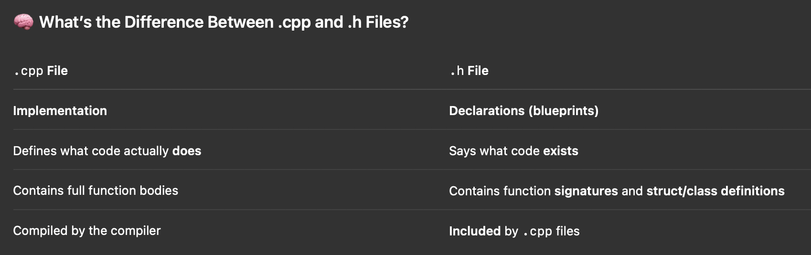

## C++ Docs

Link: [C++ Docs](https://en.cppreference.com/)

### Data Types:

#### 🟢 int → Integer

    •	Stands for “integer”
    •	Whole numbers (no decimal)
    •	Example: -3, 0, 42, 1000

```cpp
int score = 10;
```

    •	Use when you’re counting things, tracking levels, health, etc.

#### 🔵 double → Decimal (Floating-point Number)

    •	Stands for “double-precision float”
    •	Can store numbers with decimal points
    •	Example: 3.14, -7.25, 0.0001

```cpp
double accuracy = 92.5;
```

    •	Use when precision matters — like damage calculations, physics, or percentages

#### ⚪ void → No Value

    •	Means “this function doesn’t return anything”
    •	You use void when a function just does something but doesn’t give you back a result

Example:

```cpp
void greet() {
    std::cout << "Hello, player!\n";
}
```

Compared to:

```cpp
int getHealth() {
    return 100;
}
```

    •	getHealth() gives back an int
    •	greet() gives back nothing, just prints text

---

### CPP Vs. H files



🧩 Analogy: Building a Game

Think of your C++ program like a game:

    • .h = the instruction manual (what classes/functions exist, what they do)
    • .cpp = the actual code (the game logic, the mechanics, the stuff that runs)

⸻

🧱 Example:

#### combat.h – the blueprint

```cpp
#ifndef COMBAT_H
#define COMBAT_H

void takeDamage(int* target, int amount);
void heal(int* target, int amount);

#endif
```

You’re just saying:
“Hey, somewhere in this project, these functions will exist.”

#### combat.cpp – the full implementation

```cpp
#include "combat.h"
#include <iostream>

void takeDamage(int* target, int amount) {
    *target -= amount;
    if (*target <= 0) {
        std::cout << "You died!\n";
    }
}

void heal(int* target, int amount) {
    *target += amount;
    std::cout << "You healed " << amount << " HP.\n";
}
```

Now you’re telling the compiler what those functions actually do.

⸻

#### 🧠 Why Split Into .h and .cpp?

✅ 1. Modular Design

    •	Other files can #include "combat.h" without needing to know how combat.cpp works
    •	Keeps your code decoupled and easier to maintain

✅ 2. Compiler Efficiency

    •	The compiler only needs to recompile .cpp files that changed
    •	It uses .h files to check types and signatures, not to execute anything

✅ 3. Code Organization

    •	You can have dozens of files in a game — headers let you organize and share functionality without duplication
