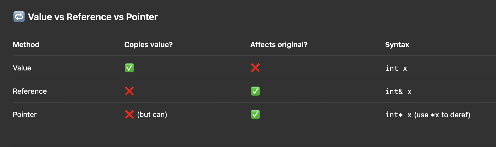

🧠 Day 3 Goals:

    1.	✅ Understand what a pointer is and why it exists
    2.	✅ Learn how to declare, assign, and dereference a pointer
    3.	✅ Get the difference between value vs reference vs pointer
    4.	✅ Build a small system (like a buff/heal or inventory reference) using pointers

⸻

### 🔹 1. What Is a Pointer?

A pointer is a variable that stores the memory address of another variable.

Instead of copying data, it says:

“Hey, the real thing is over there → go look at that memory spot.”

⸻

🔧 Example:

```cpp
int health = 100;
int* ptr = &health;  // ptr points to health’s address

std::cout << "Health: " << health << "\n";
std::cout << "Pointer value: " << ptr << "\n";      // Shows memory address
std::cout << "Pointer target: " << *ptr << "\n";    // Dereference = actual value
```

🧠 In that example:

    •	&health → “address of health”
    •	*ptr → “value at that address”

🔥 Analogy:

Think of a pointer like a treasure map:

    •	The map (pointer) tells you where the treasure is
    •	Dereferencing the map (*ptr) gives you the actual gold (value)



🧪 Today’s Mini Challenge

Make a program that:

    •	Stores a player’s health as an int
    •	Uses a heal(int* target, int amount) function to heal them
    •	Uses takeDamage(int* target, int amount) to damage them
    •	Uses raw pointers so you can directly change the value through the address
